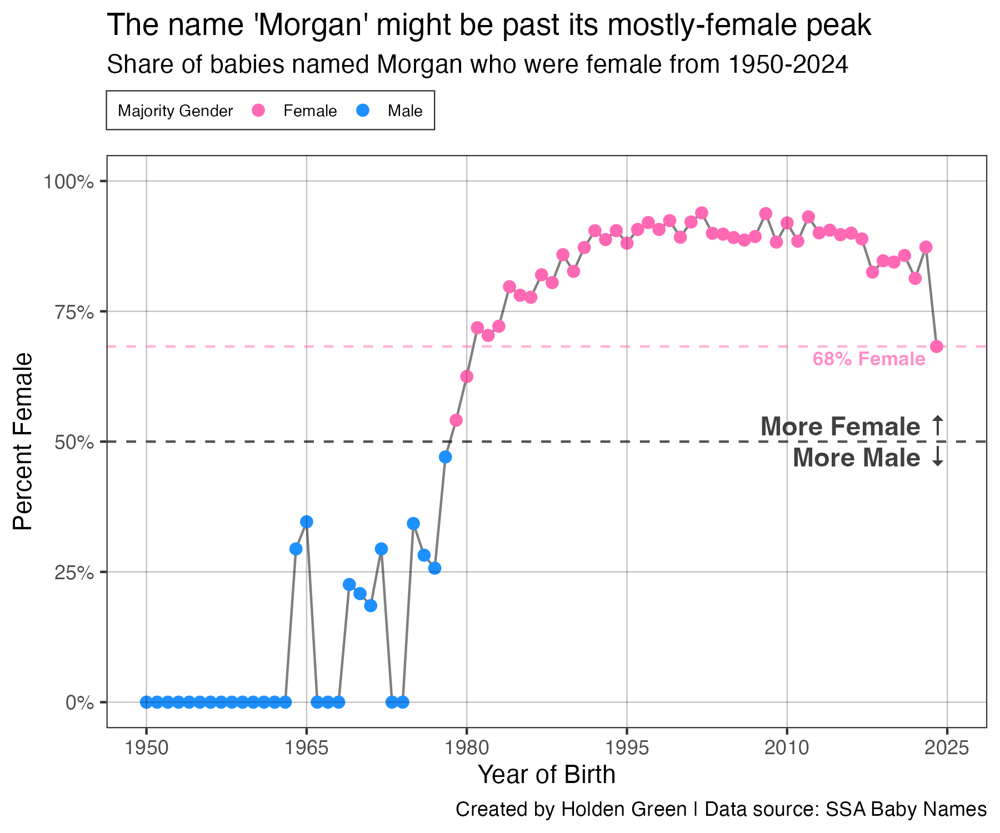
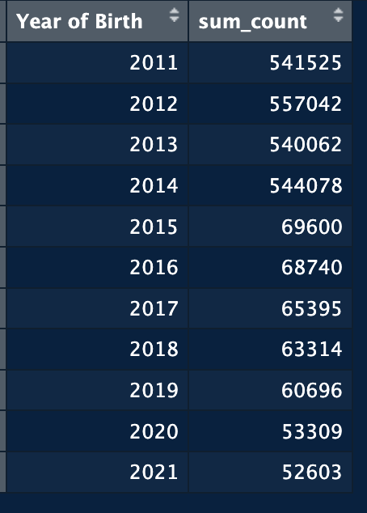

# Baby Names In-One-Chart

An *in-one-chart* story about baby names <br>
***View the full story [here](#)***

Created by **[Holden Green](https://hgorledeenn.github.io)** in February 2026 <br>
Columbia Journalism School, Algorithms class


## Contents:
1. [The Project](#the-project)
2. [Data Wrangling and Visualization](#data-wrangling-and-visualization)
3. [Survey Design](#survey-design)
4. [Setbacks](#setbacks)


## The Project

I used **[this dataset of popular baby names](https://www.ssa.gov/oact/babynames/limits.html)** from the Social Security Administration.

I was particularly interested in the topic of names that had a shift in their gender divide over time (names that were associated, over time, with both male and female babies).

After exploratory data anlysis of all the names in the dataset with some variance in the gender divide of the name, I decided to focus on the name Morgan.



In this data set, the name Morgan fluctuated from being only assigned to male babies in the 1950s and 60s, to almost exclusively assigned to female babies in the 1990s and 2000s. Recently, it's gotten closer to a 50/50 split than its been in more than 40 years.

## Data Wrangling and Visualization
All of the data wrangling and visualization was done in R. The annotated rScript file can be found at [baby_names_2.R](baby_names_2.R). All of the data wrangling and visualization happened in that rScript file, and all the data for the story came from [this .txt file](/namesbystate/NY.TXT).

I put to work a lot of concepts I'd learned from R-based classwork in undergrad and graduate classes. The clearest example of this is a for loop I created that iterates through each year of data for the gender divide of the name Morgan and creates one plot per new year. The below example is how I generated individual plots that I later put together in Photoshop to create the animation at the top of this file [morgan_over_time.gif](morgan_over_time.gif).

```R
years = c(1950:2024)

for (i in years) {
  p <- ggplot(data = filter(only_morgan, year<=i)) +
    annotate("text",
             x = 1950, y = 0.95,
             label = i,
             color = "grey20", size = 26,
             fontface = "bold", alpha=0.6, hjust=0, vjust=1) +
  aes(x=year, y=real_pct_diff, color = bigger_share) +
  geom_line(color="black", size=0.5, alpha=0.5) +
  geom_point(size=2) +
  geom_hline(yintercept = 0, color = "black", linewidth = 0.25, alpha = 0.25) +
  geom_hline(yintercept = 0.25, color = "black", linewidth = 0.25, alpha = 0.25) +
  geom_hline(yintercept = 0.5, linetype = "dashed", color = "black", linewidth = 0.5, alpha = 0.75) +
  geom_hline(yintercept = 0.75, color = "black", linewidth = 0.25, alpha = 0.25) +
  geom_hline(yintercept = 1, color = "black", linewidth = 0.25, alpha = 0.25) +
  geom_vline(xintercept = 1950, color = "black", linewidth = 0.25, alpha = 0.25) +
  geom_vline(xintercept = 1965, color = "black", linewidth = 0.25, alpha = 0.25) +
  geom_vline(xintercept = 1980, color = "black", linewidth = 0.25, alpha = 0.25) +
  geom_vline(xintercept = 1995, color = "black", linewidth = 0.25, alpha = 0.25) +
  geom_vline(xintercept = 2010, color = "black", linewidth = 0.25, alpha = 0.25) +
  geom_vline(xintercept = 2025, color = "black", linewidth = 0.25, alpha = 0.25) +
  scale_y_continuous(breaks = c(0, .25, .5, .75, 1),
                     limits = c(0, 1),
                     labels = scales::label_percent(scale = 100)) +
  scale_x_continuous(breaks = c(1950, 1965, 1980, 1995, 2010, 2025)) +
  scale_color_manual(values = c("Female" = "hotpink", "Male" = "dodgerblue")) +
  annotate("text",
           x = 2025, y = 0.53,
           label = "More Female ↑",
           color = "black", size = 4,
           fontface = "bold", alpha=.75, hjust=1) +
  annotate("text",
           x = 2025, y = 0.47,
           label = "More Male ↓",
           color = "black", size = 4,
           fontface = "bold", alpha=.75, hjust=1) +
  labs(
    title = "The name 'Morgan' might be past its mostly-female peak",
    subtitle = "Share of babies named Morgan who were female from 1950-2024",
    x = "Year of Birth",
    y = "Percent Female",
    color = "Majority Gender",
    caption = "Created by Holden Green | Data source: SSA Baby Names"
  ) +
  theme_test() +
  theme(legend.position = "top",
        legend.justification = "left",
        legend.background = element_rect(color="gray15", linetype="solid", linewidth = 0.25),
        legend.margin = margin(3,5,3,5),
        legend.title = element_text(size=7),
        legend.text = element_text(size=7),
        legend.key.size = unit(0.75,"line")) +
    guides(color=guide_legend(override.aes = list(size=2)))
  ggsave(paste0("~/Desktop/CJS/0126algorithms/HW-in-one-chart-1/year_plots_morgan/", i, ".png"), plot=p, width = 6, height = 5, units = "in")
}
```

## Survey Design
In addition to my data analysis, I designed a short survey about living with the name Morgan and sent it to people named Morgan who I found in the Columbia University Directory. I got 12 responses (an 18% response rate) and the anonimyzed data from the survey is in [anon-survey-data.csv](anon-survey-data.csv).

I found that this was an effective way to gather information about several peoples' lived experiences with the name Morgan and allowed me to, relatively quickly (at least as compared to conducting 12 individual interviews) get a range of thoughts from people named Morgan.

My survey respondents spanned age, ethinc background and gender:

| Oldest Respondent | Youngest Respondent | % White | % Black | % Female |
| --- | --- | --- | --- | --- |
| 59 Years Old | 20 Years Old | 50% | 41% |  66% |

The specific questions I asked in the survey can be found in the [appendix](#appendix).

## Setbacks
I first tried my data analysis using **[this dataset of popular baby names](https://data.cityofnewyork.us/Health/Popular-Baby-Names/25th-nujf/about_data)** from the NYC Open Data portal. I did not do enough exploratory data analysis on the dataset and, only after submitting a draft to my professor, was it pointed out that the data might have some issues.

Indeed, after I grouped by year (my original dataset only spanned 10 years) and summed the counts of each baby name, I found that the first 4 years had roughly 550,000 baby names reported each year. In the other years, the total per year is roughly 10% of that, with about 60,000 babies reported each year.
<p align="center">

</p>

Luckily, the other dataset, which I ended up using, already existed and I could somewhat easily reformat my R code to analyze my new dataset. I had originally, based on the NYC data, been interested in the name Milan and had conducted two interviews with people named Milan. These were ultimately scrapped, as the new data didn't point as strongly to Milan being an interesting name choice.

## Appendix:

The specific wording for my survey questions is below. The anonymized survey data can be found at (anon-survey-data.csv)[anon-survey-data.csv].
> 1. Name of birth of respondent
>     - “What is your name?”
>     - [short answer response]
> 
> 2. Email address of respondent
>     - ““What is your email address?”
>     - [short answer response]
> 
> 3. Email address of respondent
>     - ““What is your email address?”
>     - [short answer response]
> 
> 4. Year of birth/age of respondent
>     - “What is your birthdate?”
>     - [short answer response]
> 
> 5. Gender of respondent
>     - “What gender identity best describes you? (the data I’m analyzing only identifies male/female birth genders, but feel free to self-describe if you would prefer!)”
>     - [multiple choice w/other option]
>
> 6. Home country of respondent
>     - “Where were you born?”
>     - [Short answer]
>
> 7. Ethnic background of respondent
>     - “What is your ethnic background?”
>     - [Long answer]
>
> 8. Why are they named Morgan?
>     - “Who gave you the name Morgan and why did they > choose that name?”
>     - [Long answer]
>
> 9. Have they met other people named Morgan in their lives
>     - “Have you met other people named Morgan?”
>     - [Yes/No]
>
> 10. Number of people named Morgan
>     - “If yes, approximately how many other people named Morgan have you met in your life?”
>     - [Short answer?]
>
> 11. Count of female people named Morgan they’ve met
>     - “Approximately how many people named Morgan did you meet who were FEMALE?”
>     - [Short answer?]
>
> 12. Count of male people named Morgan they’ve met
>     - “Approximately how many people named Morgan did you meet who were MALE?”
>     - [Short answer?]
>
> 13. Miscommunications with other people named Morgan
>     - “Have you ever had a miscommunication or otherwise been confused as a result of being with another person named Morgan? (if yes, please describe)”
>     - [Long answer]
>
> 14. Follow-up interview?
>     - “Would you be comfortable with a short follow-up interview about your experiences with the name Morgan? (I will likely not reach out to everyone who says yes, and interviews could be in-person or virtually for 15 mins or less”
>     - [Yes/No]
> 